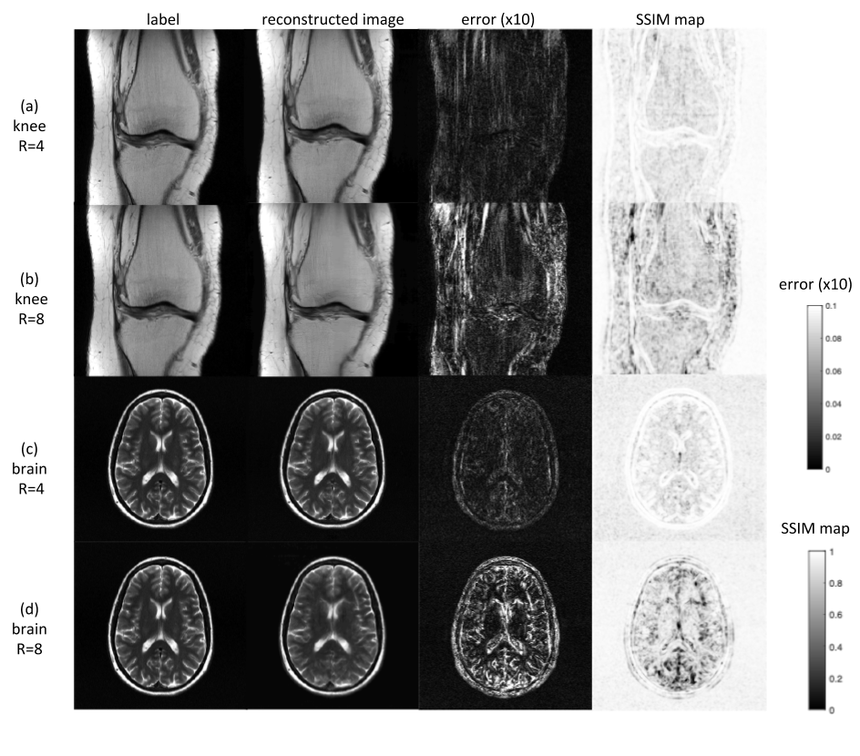

## ETER-net: An *E*nd-*T*o-*E*nd reconstruction network for MRI using *R*ecurrent neural network

### Abstract

In this work, a novel neural network architecture named 'ETER-net' is proposed as a unified solution to reconstruct an MR image directly from k-space data acquired with various k-space trajectories. <!--- [our_paper](https://github.com/changheunoh/eternet_fastmri/edit/master/README.md) -->

The image reconstruction in MRI is performed by transforming the k-space data into image domain, where the domain transformation can be executed by Fourier transform when the k-space data satisfy the Shannon sampling theory. We propose an RNN-based architecture to achieve domain transformation and de-aliasing from undersampled k-space data in Cartesian and non-Cartesian coordinates. An additional CNN-based network and loss functions including adversarial, perceptual, and SSIM losses are proposed to refine and optimize the network performance.
We validated our method by applying it to a public dataset called 'FastMRI'. [[link](https://arxiv.org/abs/1811.08839)]

### Download link

paper link : <!---  [arxiv_link](https://github.com/changheunoh/eternet_fastmri/edit/master/README.md)  -->

trained weight, input data, and label: [[link](https://drive.google.com/drive/folders/1jaKZ-J5sdypCoggGO8cIGWh3rsSemF0I?usp=sharing)]

### Image

### Table

Case | nMSE (%)  | SSIM
------------ | ------------------------- | -------------
knee R=4 | 0.84 \+- 0.96  | 0.966 \+- 0.037
knee R=8 | 1.58 \+- 0.98  | 0.931 \+- 0.038
brain R=4 | 1.19 \+- 0.62  | 0.910 \+- 0.018
brain R=8 | 5.12 \+- 0.85  | 0.854 \+- 0.029

[edit](https://github.com/changheunoh/eternet_fastmri/edit/master/README.md)

